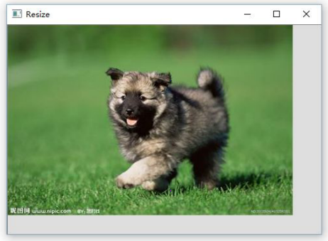

# Project Description

该项目做的是基于内容敏感的图像缩放实验。在很多时候，我们希望改变图像的尺寸，但不希望影响图片中的一些重要元素。通过选取图片中的像素，计算像素的重要性，把不重要的像素进行删除或者重复，完成对图片的尺寸变换。

通过一定的算法计算图片中像素的重要性和选择合适的一组像素进行删除，力求做到删除后的图像对重要的区域影响最小。

该项目完成了图像缩放功能，还进一步实现了预处理，加强版的像素删除代价，以及对预处理的加速。

## Development Environment

- 开发语言： C++
- 开发平台：Visual Studio 12
- 工具： OpenCV-2.4.9

## Usage

使用 Visual Studio 12 打开 resize.sln（项目的工程配置文件），按 F7 进行编译（需要预先配置 OpenCV-2.4.9），编译成功后，按 F5 运行程序。

## Algorithm

算法细节详见: [repord.pdf](./report.pdf)

Example:

## 运行示例

运行程序后会提示选择一张图片:

点确定选择一张图片:

选择图片后会提示选择评价函数的模式。输入 1 选择基础模式，2 选择加强模式（即考虑删除像素后的相邻元素的代价:

选择完后，程序会对图片进行预处理，这需要等待一段时间。然后会出现一个带有图片的窗口:

把指针移到图片下边缘或者图片右边缘或者图片右下角，按住鼠标左键进行拖动，便可以改变图像的尺寸，松开鼠标左键显示尺寸变换后的结果:

更多示例：

## 参考文献

[1]Seam Carving for Content-Aware Image Resizing.Shai Avidan et. al. SIGGRAPH 2007.

[2]Improved Seam Carving for Video Retargeting.Michael Rubinstein et. al. SIGGRAPH 2008.